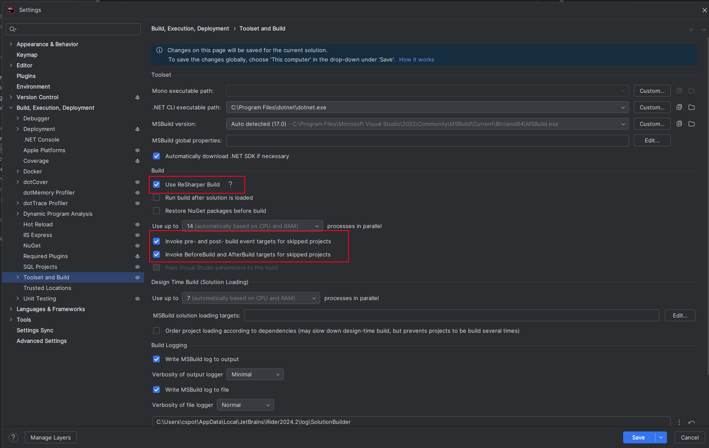

JetBrains Rider has an optimized build mode: ReSharper build. But it has caveats. If builds break, turn it off.

## Options

ReSharper build can be enabled/disabled here.

Be sure to enable the two "Invoke" options. Otherwise, important targets in our build get skipped. These targets copy
files to BepInEx plugins directory, etc.



## Clear cache

I wasted a lot of time thinking I broke the build, but actually, ReSharper build's cache was bad.

Close Rider, find the cache here, delete it, restart Rider, rebuild.  See if that helps.

Open `C:\Users\<username>\AppData\Local\JetBrains\` (`%AppDataLocal%`) and search for `SolutionCaches`

For example, for TombRush, mine was at:

```
C:\Users\cspot\AppData\Local\JetBrains\Rider2024.2\resharper-host\local\Transient\Rider\v242\SolutionCaches\_Tombrush2024.editor.-855807377.00
```
